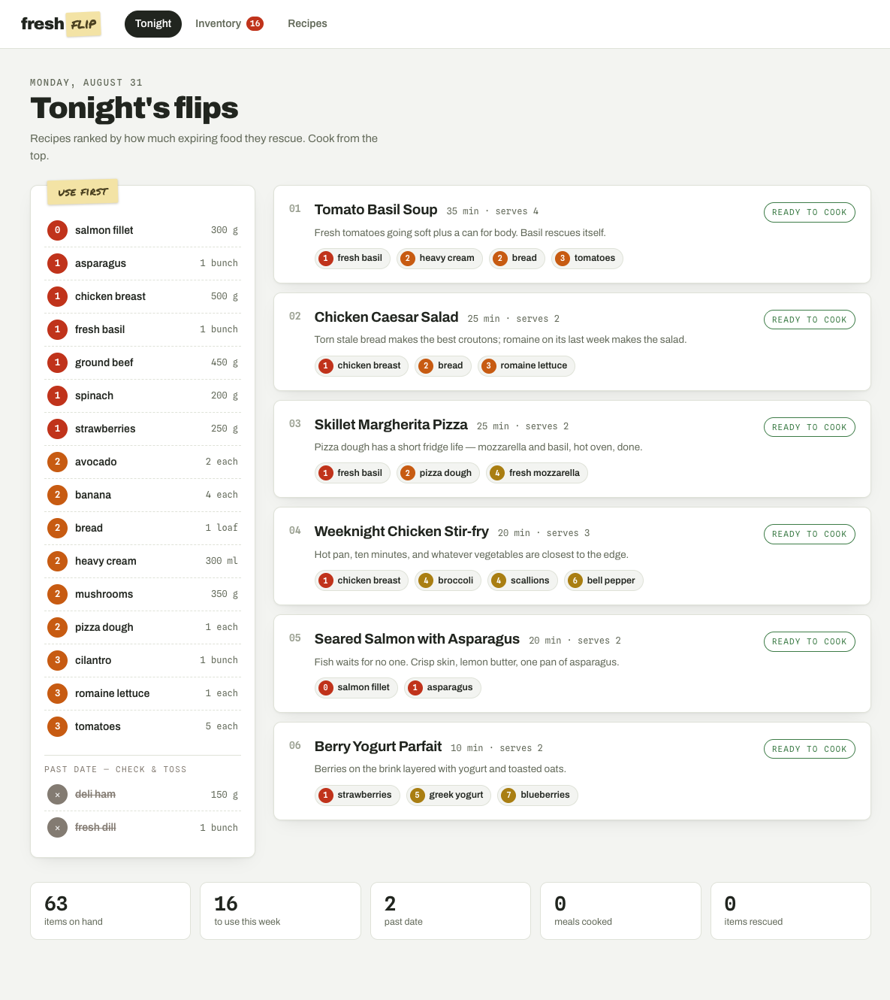
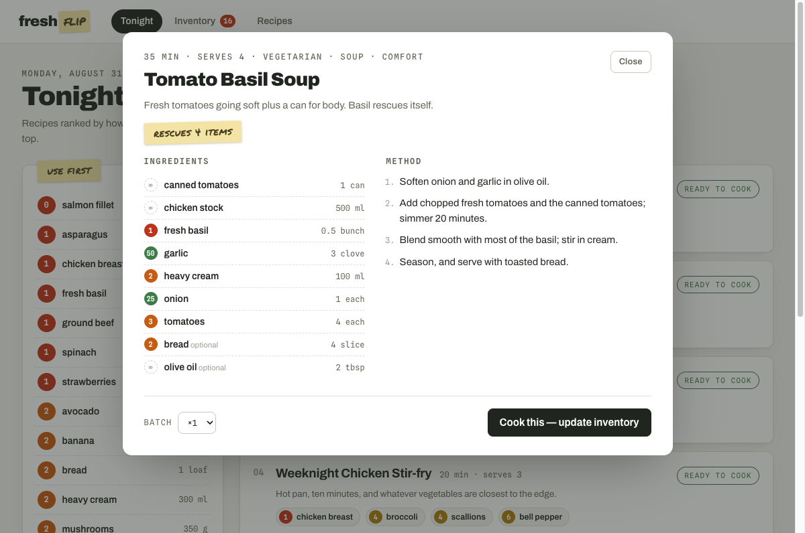

# freshflip

Kitchen and restaurant inventory that tells you **what to cook before the food goes bad**. Every item carries a day-dot counting down to its date; recipes are ranked by how much expiring food they rescue.



## How it works

- **Inventory with freshness tracking.** Items get an expiry date automatically from a shelf-life catalog (~110 ingredients, per storage location — pantry / fridge / freezer) or an explicit date. Status runs fresh → watch → soon → critical → expired.
- **Urgency-ranked recipes.** Each recipe is scored by the summed urgency of the expiring ingredients it uses (1.0 = expires today, fading over a 10-day flip window), damped by squared ingredient coverage — so a recipe you can cook *tonight* beats one that needs a shopping trip. Expired food is never recommended; it's flagged for inspection instead.
- **Cook it, and the shelves update.** Cooking a recipe decrements inventory FEFO (first-expire-first-out) and logs how many expiring items were rescued. Quantities are converted between units where that's honest (g↔kg, ml↔cup); the app refuses to guess across dimensions (a loaf is not N slices) and tells you instead.



## Stack

- **API**: [Bun](https://bun.sh) + [Hono](https://hono.dev), SQLite via built-in `bun:sqlite` (no native deps). Data lives in `data/freshflip.sqlite`.
- **Web**: React + TypeScript + Vite, hand-written CSS.
- Seeded with 24 recipes and a demo kitchen on first run.

## Run it

```sh
bun install
bun run build     # build the web app once
bun start         # serve app + API on http://localhost:8790
```

Development (API with reload on 8790 + Vite dev server on 5173):

```sh
bun run dev
```

Other commands:

```sh
bun test          # engine test suite
bun run seed      # reset inventory + cook log to fresh demo data
```
